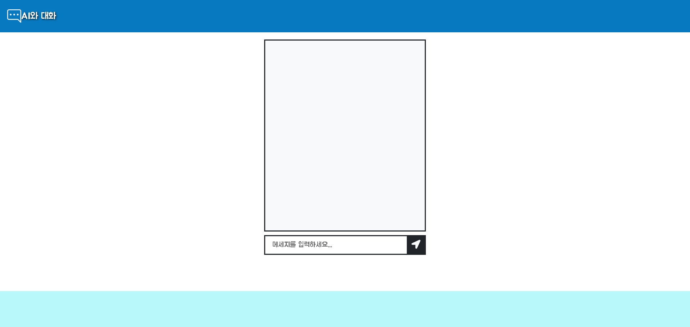
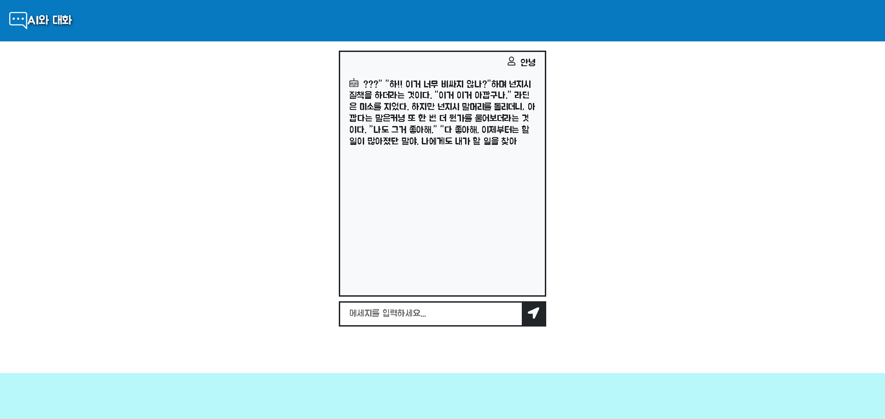

# 챗봇 프론트엔드

# 1. 개요
chatbot과 대화하는 웹 페이지 작성

# 2. 기획 이유 및 배경
사람들이 하는 말을 AI는 어떻게 해석하고 답변을 할 수 있을까?  
분명 굉장한 양의 정보와 기능이 필요할 것이다.  
간단한 chatbot을 만드는 과정을 통해 간접적이나마 이해하고자 한다.

# 3. 기능 설명
챗봇 프로그램을 실제로 보여줄 화면을 구성 
- 메세지를 입력할 창과 메세지를 출력할 창
- 자신이 입력한 내용을 넣어줄 기능
- 인공지능이 답변한 내용을 출력하는 기능

# 4. 코드 리뷰
## ChatInput.js
이용자가 메세지를 입력하고 제출할 수 있도록 작성한 코드

## ChatLog.js
입력한 메세지, 챗봇이 출력한 메세지를 볼 수 있는 창을 작성한 코드
ChatItem
- type을 통해 system=챗봇 아니면 이용자라고 인식하고 해당하는 부분으로 문장을 출력

## ChatContainer.js
실제 기능 대부분을 제어함
onSubmit
- 기본 기능을 없애고 챗봇으로 메세지를 전송하기 위한 기능을 작성
- 챗봇으로 메세지를 보내기위해 requestUrl을 정의하고 문장을 json 문자열로 변환

## ChatPage.js
실제 보이는 페이지

# 5. 구현화면
## 

# 6. 챗봇 백엔드
https://github.com/juyonghyeon/chatbot_be
